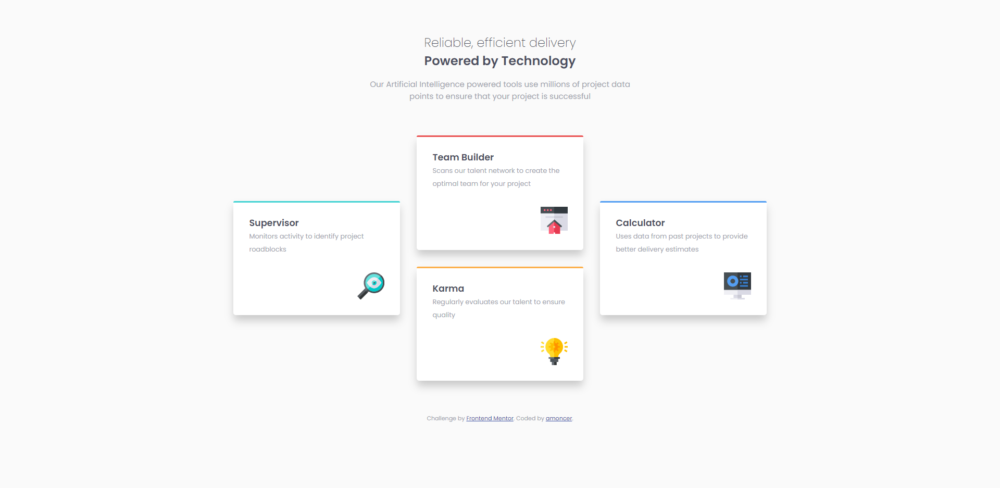

# Frontend Mentor - Four card feature section solution

This is a solution to the [Four card feature section challenge on Frontend Mentor](https://www.frontendmentor.io/challenges/four-card-feature-section-weK1eFYK). Frontend Mentor challenges help you improve your coding skills by building realistic projects.

## Table of contents

- [Overview](#overview)
  - [The challenge](#the-challenge)
  - [Screenshot](#screenshot)
  - [Links](#links)
- [My process](#my-process)
  - [Built with](#built-with)
  - [What I learned](#what-i-learned)
  - [Useful resources](#useful-resources)
- [Author](#author)

## Overview

### The challenge

Users should be able to:

- View the optimal layout for the site depending on their device's screen size

### Screenshot

### Links

- Solution URL: [Frentend Mentor](https://www.frontendmentor.io/solutions/mobilefirst-solution-using-grid-and-flexbox-Ls0a_8vWd)
- Live Site URL: [Demo On Netlify](https://amoncer-four-card-feature-section.netlify.app/)

## My process

### Built with

- Semantic HTML5 markup
- CSS
- Flexbox
- CSS Grid
- Mobile-first workflow

### What I learned

I feel more comfortable with grid layout, it's powerful.

### Useful resources

- [CSS Grid #14. Centering and Aligning Items in CSS Grid](https://www.joomlashack.com/blog/tutorials/center-and-align-items-in-css-grid/) - This helped me with grid for the desktop layout

## Author

- Frontend Mentor - [@amoncer](https://www.frontendmentor.io/profile/amoncer)
